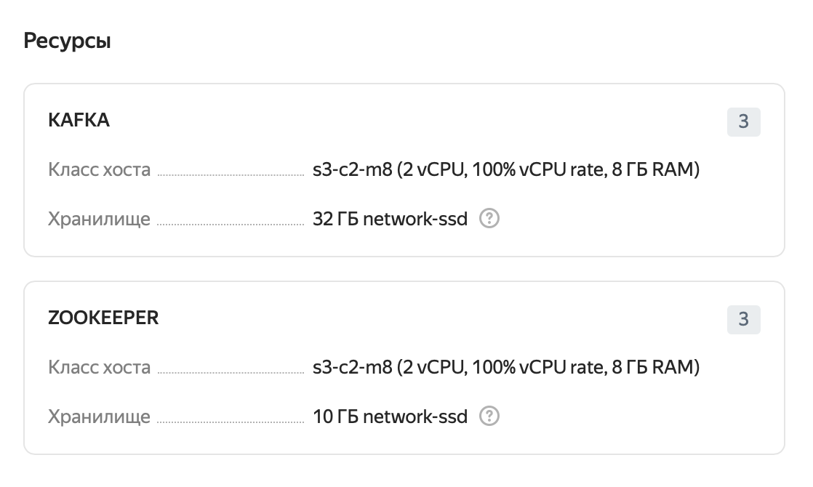
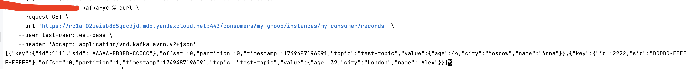
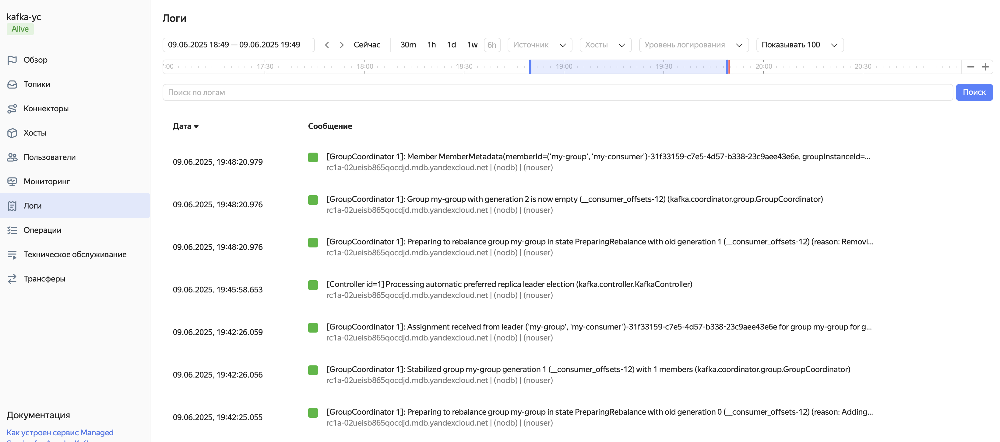

# kafka-yc

1. Создаем кластер в Managed Service for Kafka со Schema Registry, публичным доступом и 3 брокерами.
Дополнительно Kafka Rest API для управления реестром схем данных.
2. Информацию по аппаратным ресурсам

3. Создаем топик test-topic с 3 партициями и коэффициентом репликации 3, дополнительно задав нужные параметры.
4. Создаем пользователя test-user/test-pass с доступом к топику.
5. Создадим файл schema-key.json со схемой данных для ключа.
6. Создадим схему формата данных для ключа.
```
jq \
    -n --slurpfile data schema-key.json \
    '{
       "schemaType": "AVRO",
       "schema": "\($data)"
    }' \
| curl \
      --request POST \
      --url 'https://rc1a-02ueisb865qocdjd.mdb.yandexcloud.net:443/subjects/test-topic-key/versions' \
      --user test-user:test-pass \
      --header 'Content-Type: application/vnd.schemaregistry.v1+json' \
      --data "@-"
```
7. Создадим файл schema-value.json со схемой данных для знначения.
8. Создадим схему формата данных для значения.
```
jq \
    -n --slurpfile data schema-value.json \
    '{
       "schemaType": "AVRO",
       "schema": "\($data)"
    }' \
| curl \
      --request POST \
      --url 'https://rc1a-02ueisb865qocdjd.mdb.yandexcloud.net:443/subjects/test-topic-value/versions' \
      --user test-user:test-pass \
      --header 'Content-Type: application/vnd.schemaregistry.v1+json' \
      --data "@-"
```
9. Отправим сообщения.
```
jq \
    -n --slurpfile data test-message-list.json \
    '{
      "key_schema_id": "1",
      "value_schema_id": "2",
      "records": $data.[]
    }' \
| curl \
      --request POST \
      --url 'https://rc1a-02ueisb865qocdjd.mdb.yandexcloud.net:443/topics/test-topic' \
      --user test-user:test-pass \
      --header 'Content-Type: application/vnd.kafka.avro.v2+json' \
      --header 'Accept: application/vnd.kafka.v2+json' \
      --data "@-"
```
10. Создадим группу потребителей.
```
curl \
    --request POST \
    --url 'https://rc1a-02ueisb865qocdjd.mdb.yandexcloud.net:443/consumers/my-group' \
    --user test-user:test-pass \
    --header 'Content-Type: application/vnd.kafka.v2+json' \
    --header 'Accept: application/vnd.kafka.v2+json' \
    --data '{
              "name": "my-consumer",
              "format": "avro",
              "auto.offset.reset": "earliest"
            }'
```
11. Подпишемся на топик test-topic
```
curl \
    --request POST \
    --url 'https://rc1a-02ueisb865qocdjd.mdb.yandexcloud.net:443/consumers/my-group/instances/my-consumer/subscription' \
    --user test-user:test-pass \
    --header 'Content-Type: application/vnd.kafka.v2+json' \
    --header 'Accept: application/vnd.kafka.v2+json' \
    --data '{"topics": ["test-topic"]}'
```
12. Получим данные из топика в соответствии с заданой схемой.
```
curl \
    --request GET \
    --url 'https://rc1a-02ueisb865qocdjd.mdb.yandexcloud.net:443/consumers/my-group/instances/my-consumer/records' \
    --user test-user:test-pass \
    --header 'Accept: application/vnd.kafka.avro.v2+json'
```

Логи операций кластера:
